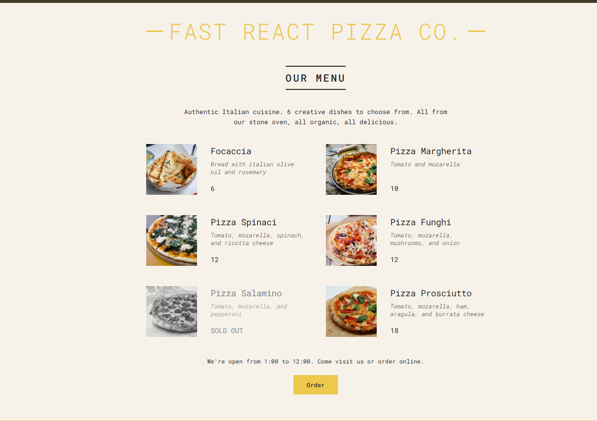

# 🍕 Pizza Menu App

A stylish React + Vite app that displays a dynamic pizza menu. Built with performance and simplicity in mind, using modern tools like React, Vite, and CSS for styling.

---

## 🚀 Live Demo

👉 [View Live on Netlify](https://pizzamenu-1.netlify.app/)

---

## 🖼️ Screenshot

 

---

## 📦 Tech Stack

- ⚛️ React
- ⚡ Vite
- 🎨 CSS (or Tailwind if used)
- 🌐 Netlify (for deployment)

---

## 📂 Run Locally

To clone and run this app locally:

```bash
git clone https://github.com/VaishMittal/Pizza-Menu.git
cd Pizza-Menu
npm install
npm run dev
